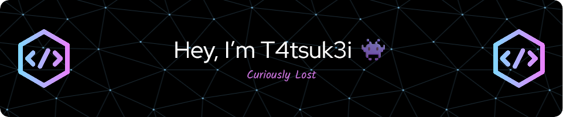

  

  

---

# 👾 Hey, I'm T4tsuk3i  
*Turning fun stuff boring since forever... and loving every second of it* 🛠️

A relentless **cybersecurity researcher**, automating everything that moves (and most things that don't).  
I don't just follow the scripts—I write my own rules. My journey through **LLMs** is filled with experiments that push boundaries and break molds. When unplugged, you'll find me cycling hard, chasing how **Tadej Pogačar** keeps outpacing every model I analyze. Spoiler alert: he's undefeated. 🚴‍♂️🧠📉

> 💙 Empowering kids through NGO  **[Make A Difference](https://makeadiff.in/)**  
> 🐧 Arch Linux fanatic — embracing complexity with elegance

---

## 🧼 A Fresh Canvas  
This account marks a reboot—no legacy noise, no baggage. Pure, focused, and crafted for exploration and innovation.

---

## 🔭 What's Brewing in the Lab?  
My current projects include:  
- 🧠 Building an AI assistant that's as sharp as it is snarky—think Neuro-sama, but with extra edge.  
- 🧰 Delving into OSINT with memory persistence that connects the dots across time and tech.  
- 🎮 Battling feature creep like it's a boss fight—because perfection is a moving target, and I'm always dodging.

*Got ideas? Feel free to reach out or collaborate!*

---

## 🎧 Soundtrack of My Code  
Currently jamming on Spotify:  

---

## 🧠 Skills at a Glance  
| Core Strengths              | Tools & Languages              | Passions                      |
|----------------------------|-------------------------------|-------------------------------|
| 🔧 Automation Architect     | 🐍 Python, Bash, C++,Java     | 🐧 Arch Linux                 |
| 🤖 AI Assistant Developer  | 🧰 Ghidra, IDA Pro             | 🧠 Neuro-symbolic AI blends   |
| 🔒 Web Exploitation        | 🚀 GitHub Actions              | 🔍 OSINT & Red Team Simulations |
| ⚙️ Reverse Engineering      | 🧩 LLM Internals               | 📚 Prompt Engineering         |

---

## ⭐ Spotlight: DatumTrace  
- 📊 [DatumTrace](https://github.com/T4tsuk3i/DatumTrace) — A next-level observability tool designed to illuminate the flow of structured data pipelines and model IO, bringing clarity to complexity.

*Explore, star, or contribute!*

---

## 🏆 Achievements & Badges  

  

---

## 📈 GitHub Pulse  

  
  

  

  

---

## 🧿 Visitor Count  

  

---

## 💬 Words to Live (and Hack) By  

> 💬 "**Wubba Lubba Dub Dub!**"  
> — *Rick Sanchez*  

> 💬 "**You know, I learned something today...**"  
> — *Stan Marsh*  

> 💬 "**The best hackers don't use 0days. They use 0trust.**"  
> — Jack Rhysider, *Darknet Diaries*

> 💥 _"Everything can be reverse engineered — even expectations."_

---

<!-- Pro Tip: Keep this README vibrant with dynamic content updates through GitHub Actions (Spotify, quotes, stats) -->
